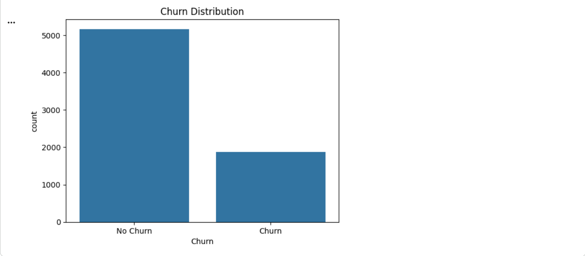
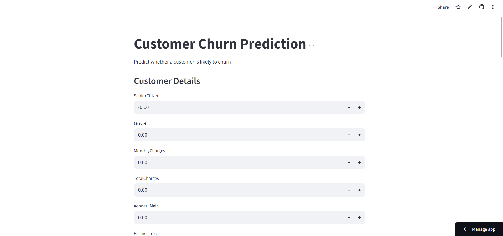

# 📉 Customer Churn Prediction

This project focuses on predicting whether a customer is likely to churn using machine learning techniques. The solution includes exploratory data analysis (EDA), model building, evaluation, and deployment as an interactive web application using Streamlit.

The goal of this project is to demonstrate an end-to-end data science workflow, from data understanding to real-world deployment.

---

## 🚀 Live Application

🔗 **Streamlit App:**  
([(https://customerchurnprediction-gxvksksbal8hnbkpcfppxn.streamlit.app/)])

---

## 📌 Problem Statement

Customer churn is a critical problem for subscription-based businesses. Retaining existing customers is often more cost-effective than acquiring new ones.

This project aims to:
- Analyze customer behavior using historical data
- Identify key factors influencing churn
- Build a machine learning model to predict churn
- Deploy the model as a user-friendly web application

---

## 📊 Dataset

- **Dataset Name:** Telco Customer Churn
- **Source:** IBM Sample Dataset (Kaggle)
- **Target Variable:** `Churn` (Yes / No)

### Key Features:
- tenure  
- MonthlyCharges  
- TotalCharges  
- Contract type  
- Internet service  
- Payment method  
- Tech support availability  

The dataset contains both numerical and categorical features, making it suitable for real-world churn analysis.

---

## 🔍 Exploratory Data Analysis (EDA)

EDA was performed to understand customer behavior and identify churn patterns.

### Churn Distribution
This plot shows the imbalance between churned and non-churned customers.

---

### Tenure vs Churn
Customers with lower tenure are more likely to churn compared to long-term customers.

---

## 🤖 Model Building

### Preprocessing Steps:
- Converted categorical variables using one-hot encoding
- Handled missing values
- Scaled numerical features where required

### Models Used:
- Logistic Regression (baseline)
- **Random Forest Classifier** (final model)

Random Forest was selected due to its ability to capture non-linear relationships and provide feature importance.

---

## 📈 Model Evaluation

The model was evaluated using:
- Accuracy
- Precision
- Recall
- F1-score
- ROC-AUC Score

ROC-AUC was emphasized due to class imbalance in churn data.

---

## 🌐 Streamlit Web Application

The trained model was deployed using **Streamlit** to provide an interactive interface where users can input customer details and receive churn predictions.

### App Home Screen

---

### Prediction Result & Feature Importance
The app displays:
- Churn prediction (Yes / No)
- Churn probability
- Top features influencing the prediction

---

## 🧠 Key Insights

- Customers on month-to-month contracts are more likely to churn
- Lower tenure significantly increases churn probability
- Higher monthly charges contribute to higher churn risk
- Long-term contracts and additional services reduce churn

---

## 🛠️ Tech Stack

- **Programming Language:** Python  
- **Libraries:** Pandas, NumPy, Scikit-learn, Matplotlib, Seaborn  
- **Model:** Random Forest Classifier  
- **Deployment:** Streamlit  
- **Version Control:** Git & GitHub  

---

## 📁 Project Structure

Customer_Churn_Prediction/
│
├── assets/ # Screenshots used in README
├── data/ # Dataset
├── models/ # Trained model files
│ ├── churn_model.pkl
│ └── model_features.pkl
├── notebook/ # Training and EDA notebook
├── app.py # Streamlit app
├── requirements.txt # Dependencies
└── README.md

---

## ▶️ How to Run Locally

bash
pip install -r requirements.txt
streamlit run app.py

---

📌 Conclusion

This project demonstrates a complete data science lifecycle:
-Data analysis
-Feature engineering
-Model training and evaluation
-Deployment of a machine learning model

---

👤 Author

Rahul Raj
B.E. – Artificial Intelligence & Machine Learning

